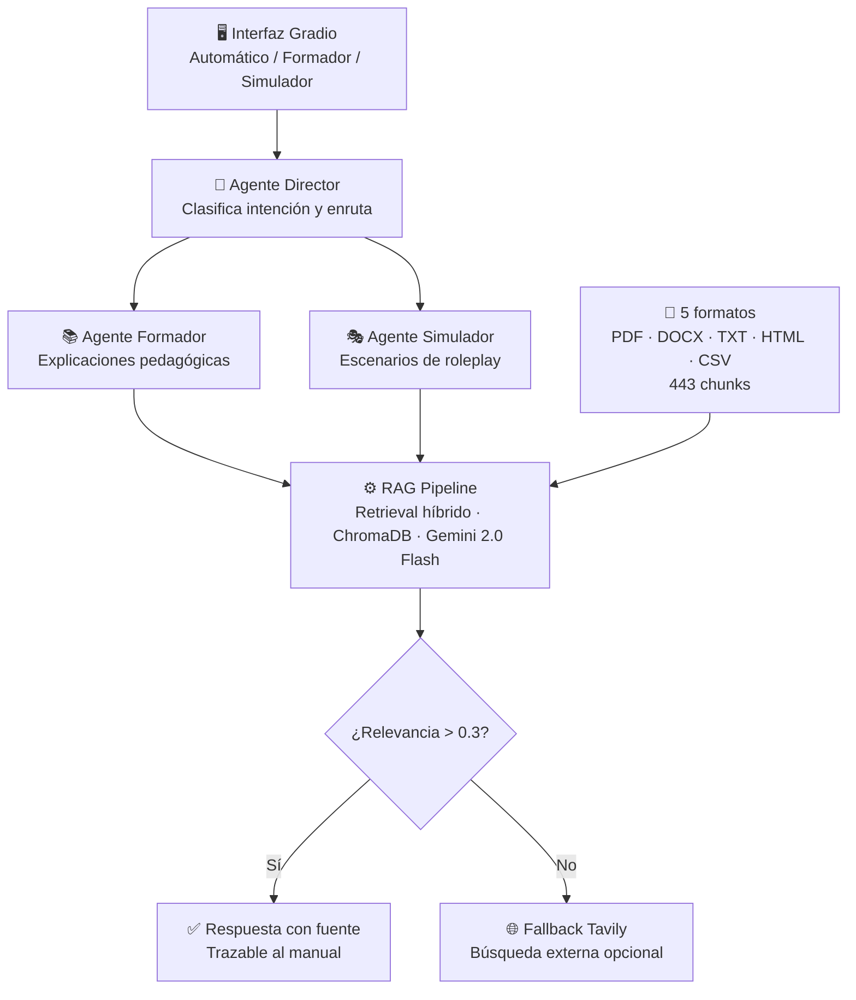

# 🔥 SARFIRE-RAG: Asistente Inteligente para Emergencias Forestales

> Sistema RAG multiformato con agentes especializados para formación, simulación y consulta operativa en el ámbito de incendios forestales.

**▶️ Vídeo demo:** https://youtu.be/k4mQNYBAE08

---

## El problema que motiva este proyecto

Los servicios de emergencias forestales trabajan con una paradoja cotidiana: disponen de gran cantidad de documentación técnica —protocolos, manuales operativos, guías de seguridad, dispositivos tácticos— pero esa información es difícilmente accesible en los momentos que más importa. Los manuales son extensos, están dispersos en múltiples formatos, y requieren experiencia para interpretarlos correctamente. No existe ninguna herramienta que permita consultar esa documentación en lenguaje natural, ni que sea capaz de generar automáticamente formación o escenarios de simulación a partir de ella.

Como bombero profesional, conozco de primera mano esta fricción. SARFIRE-RAG nace de la voluntad de transformar documentación estática en conocimiento aplicable: un asistente que responda, forme y simule con la misma base documental que ya existe en los servicios de emergencias.

---

## Qué hace el sistema

SARFIRE-RAG es un asistente inteligente basado en RAG (Retrieval-Augmented Generation) que procesa documentación técnica de emergencias forestales en cinco formatos distintos y la convierte en respuestas operativas, contenido formativo y escenarios de simulación. El sistema no inventa: recupera fragmentos reales de los manuales, los usa como contexto y genera respuestas trazables hasta la fuente.

Tres modos de uso, tres agentes especializados:

- **Formador**: responde consultas técnicas con base en los manuales. Explica procedimientos, aclara conceptos, guía el aprendizaje con rigor documental.
- **Simulador**: genera escenarios de roleplay operativo. Plantea situaciones críticas, evalúa las decisiones del usuario y proporciona feedback basado en protocolos reales.
- **Director**: clasifica automáticamente cada consulta y la enruta al agente más adecuado. El usuario puede confiar en el modo automático o elegir directamente.

---

## Arquitectura del sistema



El flujo completo, desde que el usuario escribe hasta que recibe respuesta, pasa siempre por el RAG. No hay respuesta sin respaldo documental.

---

## Base documental: 5 formatos, 443 chunks

El requisito de multiformato no es cosmético. En un servicio de emergencias real, la documentación existe en formatos heterogéneos: PDFs escaneados, documentos Word de procedimientos, hojas de cálculo de recursos, páginas HTML de protocolos, ficheros de texto de checklists. El sistema procesa todos ellos.

| Formato | Documento | Chunks |
|---------|-----------|--------|
| PDF | DTF-13 Organización y Gestión de Incendios | 66 |
| PDF | IVM1 - Comportamiento del Fuego (6 módulos) | 328 |
| DOCX | Resumen Ejecutivo DTF-13 | 15 |
| TXT | Checklist de Seguridad Operativa | 9 |
| HTML | Protocolos de Emergencias | 10 |
| CSV | Recursos de Emergencias Valencia | 15 |
| **Total** | **12 documentos** | **443 chunks** |

El proceso de ingesta para cada formato es el siguiente:

- **PDF**: `PyPDFLoader` de LangChain, chunking con `RecursiveCharacterTextSplitter` (chunk_size=500, overlap=100).
- **DOCX**: `python-docx` extrae párrafos, mismo splitter que PDF.
- **TXT**: `TextLoader` de LangChain + splitter.
- **HTML**: `BeautifulSoup4` extrae texto limpio eliminando tags, scripts y estilos + splitter.
- **CSV**: cada fila se convierte en un `Document` independiente con sus columnas como contexto. No aplica splitter —cada fila ya es una unidad semántica.

Esta decisión de no aplicar splitter al CSV es deliberada: fragmentar una fila de datos tabulares introduce ruido sin añadir información.

---

## Decisiones técnicas clave

### RAG sobre LLM puro

La alternativa más simple hubiera sido un LLM sin recuperación: hacer la pregunta directamente a Gemini o GPT y obtener una respuesta. Se descartó porque en un dominio crítico como emergencias, la trazabilidad es un requisito, no una mejora. Cada respuesta de SARFIRE-RAG muestra en el bloque de evidencia los fragmentos exactos de los manuales que la sustentan. El tribunal puede verificar; el bombero puede confiar.

### Búsqueda híbrida

El retrieval combina similitud semántica (vectores, 70%) y coincidencia por palabras clave (30%). La razón es práctica: la terminología técnica de bomberos —"faja cortafuegos", "brigada helitransportada", "BRIF", "DTF-13"— no siempre tiene representación semántica adecuada en modelos de embeddings de propósito general entrenados principalmente en inglés. La búsqueda por keywords actúa como red de seguridad para estos términos especializados.

### Embeddings: all-MiniLM-L6-v2

Se eligió este modelo por tres razones: ejecución local sin dependencias cloud, dimensión 384 (eficiente en memoria y velocidad), y calidad semántica suficiente para texto técnico en español. Modelos más grandes como `multilingual-e5-large` ofrecen mejor cobertura multilingüe pero requieren significativamente más recursos, incompatibles con el entorno de desarrollo local de este proyecto.

### Gemini 2.0 Flash como generador

Temperatura 0.3: suficientemente baja para priorizar fidelidad al contexto recuperado sobre creatividad narrativa. En un asistente operativo, la precisión importa más que la fluidez. Un agente que "alucina" en un escenario de emergencias es peor que uno que dice "no encuentro información sobre esto en los manuales".

### Agentes especializados vs. único agente generalista

Un agente único con un prompt largo es la solución más simple. Se descartó porque los tres modos requieren estilos de respuesta fundamentalmente distintos: el Formador necesita precisión y estructura pedagógica; el Simulador necesita narrativa, tensión dramática y evaluación de decisiones. Un solo prompt no puede optimizar ambos. La separación en agentes mejora el control semántico y facilita la extensión futura del sistema.

### Fallback externo controlado

Cuando el retrieval no supera el umbral de relevancia (0.3), el sistema no inventa: pregunta al usuario si desea buscar en fuentes externas vía Tavily. Esta decisión de diseño —mantener el control en el usuario— es crítica en un dominio donde una respuesta incorrecta con apariencia de autoridad podría tener consecuencias reales.

---

## Cómo ejecutar

**Requisitos:** Python 3.12, WSL Ubuntu, venv

```bash
# 1. Clonar el repositorio
git clone https://github.com/josubb-lab/sarfire-rag.git
cd sarfire-rag

# 2. Crear y activar entorno virtual
python3 -m venv venv
source venv/bin/activate

# 3. Instalar dependencias
pip install -r requirements.txt

# 4. Configurar variables de entorno
cp .env.example .env
# Editar .env con tus claves:
# GOOGLE_API_KEY=...
# TAVILY_API_KEY=...  (opcional, solo para fallback externo)

# 5. Indexar documentos (primera vez)
python tools/build_index.py

# 6. Lanzar la aplicación
python app.py
```

Acceder en: http://127.0.0.1:7860

---

## Demo en 3 preguntas

Para validar el sistema de forma rápida, estas tres consultas cubren los tres modos y los casos de uso principales:

**1. Consulta técnica (Formador):**
> "¿Cuál es el procedimiento de seguridad al trabajar con motosierras en incendios forestales?"

**2. Simulación operativa (Simulador):**
> "Roleplay: soy jefe de brigada ante un incendio en pinar con viento fuerte y pendiente pronunciada. Evalúa mis decisiones."

**3. Consulta fuera de dominio (Director / fallback):**
> "¿Qué me recomiendas para preparar una barbacoa en el bosque?"

La tercera consulta verifica el comportamiento correcto ante información no disponible en los manuales: el sistema debe identificar la falta de relevancia y ofrecer la opción de búsqueda externa, no inventar una respuesta.

---

## Validación realizada

La validación del MVP se ha basado en pruebas funcionales manuales que cubren los flujos principales:

- Consultas técnicas verificadas contra el contenido real de los manuales (Formador): las respuestas citan fragmentos identificables.
- Generación de escenarios coherentes con terminología operativa real (Simulador): los escenarios usan vocabulario de bomberos, no genérico.
- Enrutamiento correcto por el Director en consultas ambiguas: se verificó que consultas formativas van al Formador y consultas de roleplay van al Simulador.
- Comportamiento del bloque de evidencia: muestra fuente y nivel de soporte para cada respuesta.
- Activación correcta del fallback cuando la relevancia es baja.

---

## Limitaciones y mejoras futuras

La calidad de las respuestas depende directamente del contenido indexado. Un manual mal digitalizado (OCR defectuoso, tablas no estructuradas) produce chunks de baja calidad que degradan el retrieval. En este MVP, todos los documentos son texto limpio; un sistema en producción requeriría un pipeline de control de calidad documental.

La búsqueda externa vía Tavily falla en algunos entornos de red. Esta limitación está documentada: el sistema funciona correctamente en modo interno; el fallback es una funcionalidad adicional, no un componente crítico.

Mejoras identificadas para versiones futuras: embeddings multilingües especializados en español técnico, re-ranking con cross-encoder para mejorar la precisión del retrieval, memoria de sesión persistente entre conversaciones, y evaluación automática de la calidad de respuestas con métricas como RAGAS.

---

## Estructura del repositorio

```
sarfire-rag/
├── app.py                          # Entrypoint principal (Gradio)
├── requirements.txt
├── .env.example
├── data/
│   ├── raw/                        # Documentos fuente (5 formatos)
│   └── processed/chromadb/        # Índice vectorial (generado)
├── src/
│   ├── document_loaders.py        # MultiFormatLoader (PDF/DOCX/TXT/HTML/CSV)
│   ├── agents/                    # Director, Formador, Simulador
│   └── rag/                       # RAG Pipeline
└── tools/
    └── build_index.py             # Script de indexación
```

---

*Proyecto desarrollado como Trabajo Final de Máster — BIG School, Máster en Data Science con IA.*  
*Autor: Josué — Bombero profesional y Data Scientist.*